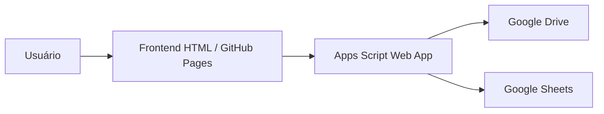

# Levantamento de Ocupação Máxima — SENAI/MS

Sistema web para cadastro de ambientes físicos, armazenamento automático de imagens no Google Drive e registro estruturado no Google Sheets.

---

## Acesso ao Sistema

### Aplicação publicada (GitHub Pages)

🔗 https://gabriel-colman.github.io/formulario-ocupacao/formulario-ocupacao.html

---

## Tecnologias Utilizadas

- HTML5
- CSS3
- JavaScript
- GitHub Pages
- Google Apps Script
- Google Drive API (via Apps Script)
- Google Sheets API (via Apps Script)

---

## Arquitetura do Projeto



---

## Fluxo de Funcionamento

### 1 — Usuário preenche o formulário

Informações coletadas:

- Unidade SENAI
- Responsável
- Cargo
- Data
- Nome do espaço
- Tipo do espaço
- Capacidade
- Área
- Equipamentos
- Acessibilidade
- Observações
- Upload de imagens

---

### 2 — Frontend envia os dados

O HTML utiliza JavaScript (`fetch`) para enviar um payload JSON para o backend Apps Script.

Exemplo simplificado:

```javascript
fetch(SCRIPT_URL,{
    method:'POST',
    body: JSON.stringify(payload)
})
```

---

### 3 — Backend Apps Script processa

O Apps Script:

- recebe o JSON;
- cria pasta de protocolo no Drive;
- cria subpastas por espaço;
- salva imagens;
- gera links compartilháveis;
- registra os dados na planilha.

---

### 4 — Google Drive

Estrutura criada automaticamente:

```text
Ocupacao/
└── FOTOS/
    └── OC-20260601-103815 — Unidade
        └── 1 - Sala de Aula
            ├── foto1.jpg
            ├── foto2.jpg
```

---

### 5 — Google Sheets

Os registros são armazenados automaticamente.

Estrutura atual:

| Coluna | Campo |
|--------|--------|
| A | Unidade |
| B | Responsável |
| C | Cargo |
| D | DataLevantamento |
| E | NomeEspaco |
| F | TipoEspaco |
| G | BlocoPavimento |
| H | Capacidade |
| I | Area |
| J | Equipamentos |
| K | Acessibilidade |
| L | Status |
| M | Observacoes |
| N | Tipo de Item |
| O | Caminho |

---

## Backend — Google Apps Script

Backend desenvolvido em Google Apps Script.

Responsabilidades:

✔ Receber payload JSON

✔ Processar upload Base64

✔ Criar pastas automaticamente

✔ Salvar imagens no Drive

✔ Registrar dados na planilha

✔ Gerar links dos arquivos

---

## Configuração do Apps Script

Publicação:

```text
Implantar
→ Nova implantação
→ Aplicativo da Web
→ Executar como: Eu
→ Quem possui acesso: Qualquer pessoa
```

---

## Problemas Encontrados

### CORS — GitHub Pages × Apps Script

Problema identificado:

Frontend hospedado no GitHub Pages bloqueava a resposta do Apps Script.

Solução aplicada:

```javascript
headers:{
    'Content-Type':'text/plain;charset=utf-8'
}
```

e ajuste no tratamento do `fetch()`.

---

## Estrutura do Repositório

```text
formulario-ocupacao/
│
├── formulario-ocupacao.html
├── README.md
```

---

## Autor

**Gabriel Colman Rodrigues**

GitHub:

https://github.com/gabriel-colman

---

## Observações

Projeto desenvolvido para gerenciamento de levantamento de ocupação máxima de ambientes educacionais do SENAI/MS.